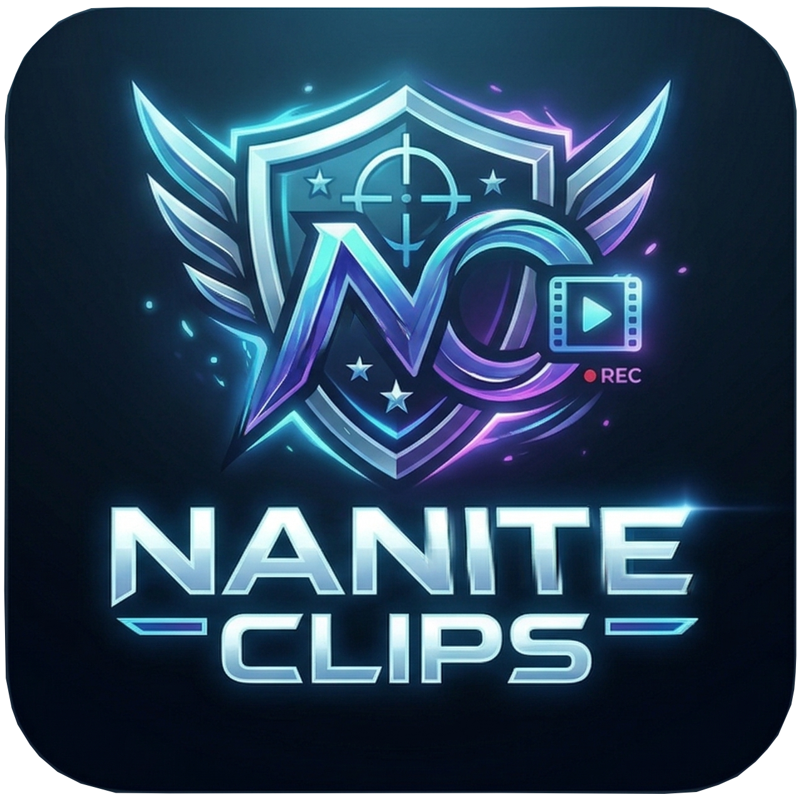

# NaniteClip

NaniteClip is a desktop companion for PlanetSide 2 that keeps a rolling replay buffer and saves
clips automatically when notable gameplay events occur. It watches the running game, subscribes to
Daybreak Census events for your characters, evaluates those events with a rule engine, and triggers
the active capture backend to save the relevant segment.

## Features

- Event-driven auto-clipping using live Census events and a scoring rule engine with profiles and
	auto-switching.
- Replay-buffer capture backends: gpu-screen-recorder on Linux and OBS Studio via obs-websocket
	(Linux/Windows).
- Manual clip hotkeys on Linux (X11/Wayland, including a KDE Wayland helper) and Windows.
- Multi-track audio capture and post-processing (premix, normalization, track labels, gain).
- Clip history, filters, stats, and montage creation.
- Optional storage tiering, Discord webhooks, and uploads (Copyparty, YouTube).

## How It Works

1. Detect PlanetSide 2 and the active capture target.
2. Resolve configured characters and subscribe to live Census streams.
3. Classify events and run them through rule profiles.
4. Trigger clip saves on the active capture backend.
5. Post-process and distribute clips based on your settings.

## Requirements

### Core

- PlanetSide 2.
- A Daybreak Census service ID (used for live event subscriptions).

### Capture backends

- Linux:
	- gpu-screen-recorder in PATH for the default backend.
	- PipeWire for per-application audio capture (requires a gsr build with app audio support).
- OBS backend (Linux or Windows):
	- OBS Studio 28+ with obs-websocket enabled.

### Optional tooling

- ffmpeg 4.2+ for audio post-processing, montage creation, and Discord thumbnails.
- Wayland hotkeys use xdg-desktop-portal GlobalShortcuts.
- KDE Wayland hotkeys can use the optional platform helper built from native/platform_service.

## Installation (GitHub Releases)

### Linux (x86_64)

1. Debian/Ubuntu:
	 - Download the latest .deb artifact.
	 - Install it:
	   - sudo apt install ./nanite-clip_<version>_amd64.deb
2. Fedora/openSUSE/RHEL-like:
	 - Download the latest .rpm artifact.
	 - Install it with your package manager (example for dnf):
	   - sudo dnf install ./nanite-clip-<version>-1.x86_64.rpm
3. Arch Linux:
	 - Download the latest .pkg.tar.zst artifact.
	 - Install it:
	   - sudo pacman -U ./nanite-clip-<version>-1-x86_64.pkg.tar.zst
4. Flatpak (experimental, OBS backend focused):
	 - Download the latest .flatpak artifact.
	 - Install it:
	   - flatpak install ./nanite-clip-<version>-x86_64.flatpak
	 - Run it:
	   - flatpak run dev.angz.NaniteClip
5. Portable tarball fallback:
	 - Download nanite-clip-<version>-x86_64-linux.tar.gz.
	 - Extract and run:
	   - tar -xzf nanite-clip-<version>-x86_64-linux.tar.gz
	   - ./nanite-clip
	 - Keep nanite-clip-platform-service next to the main binary if you want KDE Wayland hotkeys.
	 - Optional desktop integration (per-user): copy desktop/icon files from usr/share in the archive
	   into ~/.local/share/applications and ~/.local/share/icons/hicolor/512x512/apps.
6. Linux backend dependencies:
	 - The .deb and .rpm release packages declare optional metadata for the default Linux backend
	   (recommended: gpu-screen-recorder, suggested: gpu-screen-recorder-notification).
	 - The .deb/.rpm/.pkg.tar.zst packages also install AppStream metadata and refresh desktop/icon
	   caches during install/remove where the host tooling is available.
	 - If your distro repository does not provide those exact package names, install the dependencies
	   manually and use the portable tarball release.

### Windows (x86_64)

1. Download and run the MSI installer (nanite-clip-<version>-x86_64.msi).
2. Optional portable fallback: download nanite-clip.exe and run it from a folder you keep around for updates.
3. Install OBS Studio 28+ and enable obs-websocket, then choose the OBS backend in Settings.

## Installation (from source)

1. Install Rust nightly (this repo pins nightly via rust-toolchain.toml).
2. Clone NaniteClip:
	 - git clone https://github.com/AnotherGenZ/nanite-clip
3. Optional KDE Wayland hotkey helper dependencies (Linux):
	 - CMake, Ninja, Qt6, and KDE KF6 libs (kcoreaddons, kdbusaddons, kglobalaccel).
	 - To skip building the helper, set NANITE_CLIP_SKIP_PLATFORM_SERVICE_BUILD=1.
4. Build and run:
	 - cargo run
	 - Or just run if you have just installed.

## Usage

1. Launch NaniteClip.
2. Open Settings and set your Daybreak Census service ID.
3. Add one or more PlanetSide 2 characters.
4. Choose a capture backend:
	 - gpu-screen-recorder: configure capture source, save directory, buffer length, and audio
		 sources.
	 - OBS: set the websocket URL/password and choose a management mode.
5. Configure rules and profiles (and auto-switch rules if desired).
6. Enable manual clip hotkey if you want instant saves.
7. Start Monitoring. The status will move through Waiting for PS2 -> Waiting for login -> Monitoring.
8. Play PlanetSide 2. Clips appear in the Clips tab, with optional post-process, uploads, and
	 webhooks.

## OBS backend notes

- Management modes:
	- Bring Your Own: you control the replay buffer in OBS.
	- Managed Recording: NaniteClip applies OBS replay buffer settings.
	- Full Management: reserved in the UI, not yet supported at runtime.
- In this release, OBS saves the full replay buffer even when per-clip lengths are requested.

## Development

- cargo test runs rule-engine unit tests.
- cargo fmt and cargo clippy --all-targets --all-features match CI.
- RUST_LOG=nanite_clip=debug cargo run -- for verbose logging.
- Releases are assembled with scripts/release.sh (or just release <version>) and require git-cliff.
- Release notes and CHANGELOG.md are generated from Conventional Commit scanning via git-cliff.

## Configuration

NaniteClip stores its settings in the platform config directory (for example,
~/.config/nanite-clip/config.toml on Linux). Secrets like the OBS websocket password are stored in
the secure store instead of the config file.
