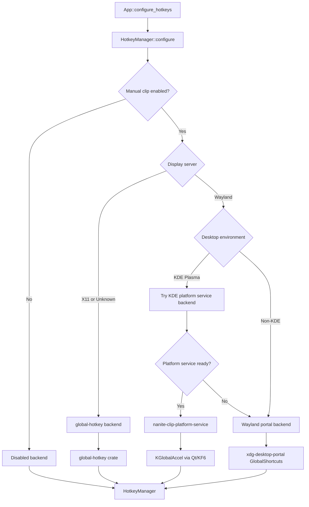
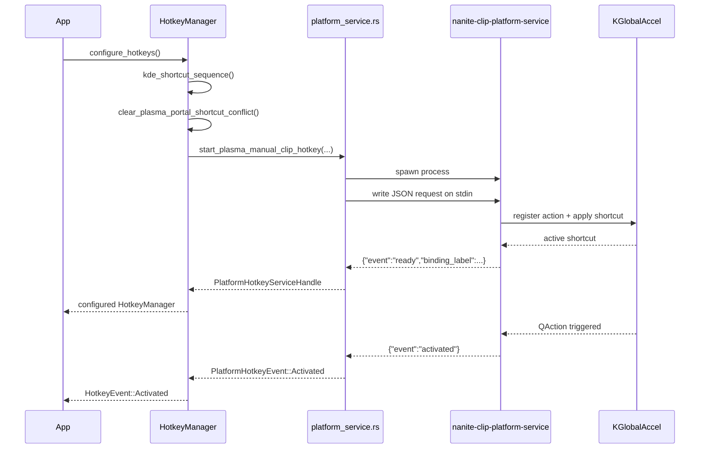

# Hotkey Architecture

This diagram reflects the current manual-clip hotkey flow after the KDE redesign.

## Backend Selection

## KDE Platform Service Flow

## Notes

- Default KDE Wayland path is the platform service.
- If the KDE platform service is unavailable, KDE Wayland falls back to the same XDG portal backend used by other Wayland desktops.
- Non-KDE Wayland sessions go directly to the XDG portal backend.
- Non-Linux platforms use the same `global-hotkey` backend directly.
- The platform service boundary is intended to be reusable for future Linux-native integrations beyond hotkeys.
